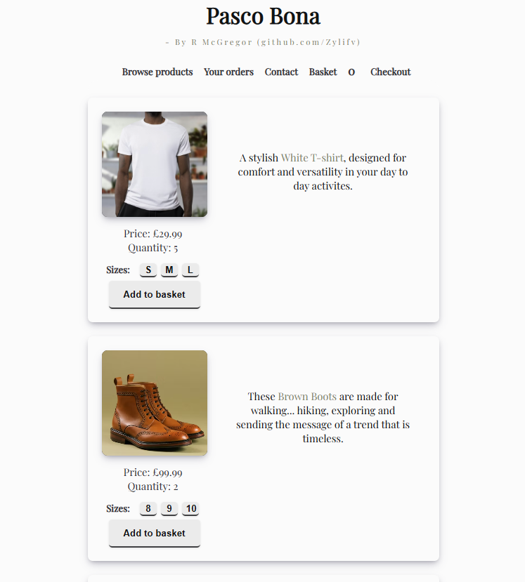

# Online-Shop-REACT

My first online-shopping website created using Typescript and REACT.

--COMPLETE REFACTOR IN PROGRESS--

I wanted to see how much I could create for a website that imitates an online shopping experience using both TS & REACT. I found quite a lot of trouble when i first started with things like appending created elements to my intended parent elements. I found this when creating the basket for the user to see what they have put in the basket so far, including the item name, price, size etc and a basket cost total. In JS and even really vanilla TS you can append children quite easily because the elements aren't in a state where they dont exist according to the DOM. I found i had to rely on components generating divs containing the information i had stored in "state", then render that information to the relevant parent element when it is called. This gave me a real understanding of how hooks, components and rendering via state works in REACT and im glad i decided to keep pushing through with it.

There are still some elements that i need to work on and could improve, such as:

 - Items in the basket, if they are the same, have a "x(n)" next to just one rendered element instead of creating one every time the user adds the same item to the basket. This is just cleaner for the user to understand
 - Have the "orders" tab generate an order number if the user goes through with "purchasing" and order.
 - Have a way for the customer to "check-out" with their basket and have a process for that.

These improvements will create a much more complete experience, but for now this was just for me to see how much i could do on my own with the knowledge i have accumulated over time.

For a working example of this project, please use my CodePen link below:

https://codepen.io/BobbyArmac/full/pvEWbMN

Alternatively, you can use this CodeSandbox link:

https://fjpy32-3000.csb.app/
